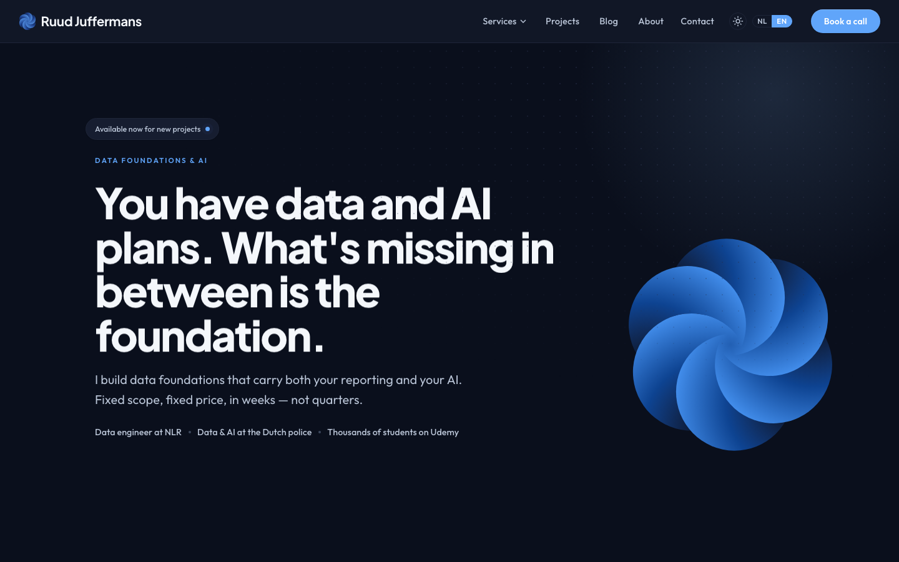

# ruudjuffermans-portfolio

Personal portfolio site for finding a job: a bilingual (Dutch / English)
Next.js site with project write-ups, a blog, an about/résumé page and a
contact form. Forked from the freelance (ZZP) site
[ruudjuffermans.nl](https://ruudjuffermans.nl) and repositioned from "hire me
for a fixed-price package" to "hire me for your team".

[](https://ruudjuffermans.nl)

## What changed from the freelance site

- **No services or packages.** The six priced packages, their detail pages,
  the nav dropdown, footer links, sitemap entries and `llms.txt` sections are
  gone. Old `/diensten/*` and `/en/services/*` URLs redirect to the projects
  overview.
- **Homepage sections:** hero (open to new roles), what I do, **experience**
  (three roles as cards), projects, **how I work** (four working habits),
  latest articles, and a CTA pointing at contact + LinkedIn.
- **About page** gained an experience section with per-role bullets, and the
  skill chips now match what the projects and articles actually show.
- **Copy** throughout is aimed at a hiring manager: "Get in touch" instead of
  "Book a call", "Open to new roles" instead of "Available for new projects".
- **Blog:** the two pricing posts ("what does a dashboard / data warehouse
  cost") were dropped; the remaining post that linked into the packages now
  points at the open-data-warehouse project instead.
- **Structured data:** a `Person` (jobTitle Data Engineer) instead of a
  `ProfessionalService`.

The design system, animations, i18n setup, MDX content pipeline and the
platform-API integration (contact form, newsletter, analytics) are unchanged.

## Tech stack

| Layer    | Technology |
| -------- | ---------- |
| Frontend | Next.js 15 (App Router), React 19, Material UI 6, next-intl, MDX |
| Backend  | [`ruudjuffermans-server`](https://github.com/ruud-juffermans/ruudjuffermans-server) — Express + Prisma, `website` module |
| Tooling  | TypeScript, Docker / Docker Compose |

## Project structure

```
.
├── client/          # Next.js frontend (the deployed artifact)
│   ├── content/     # MDX blog & project content (nl / en)
│   ├── messages/    # i18n translation files
│   └── src/
├── .env.example     # Client env template
└── docker-compose.yml   # Production stack: client-only Next.js image
```

## Local development

Run the platform API first, then the site:

```bash
# 1. API — in ../ruudjuffermans-server (see its README):
docker compose -f docker-compose.dev.yml up -d && npm run dev   # :4000

# 2. This site:
cd client
npm install
npm run dev                                                     # :3000
```

With `NEXT_PUBLIC_API_URL` unset (the dev default), the browser calls
same-origin `/api/*` and `next.config.ts` rewrites it to the local platform
server on `:4000`. Contact/verification emails print to the platform server's
console when it has no `SMTP_HOST` configured.

Configuration (see [`.env.example`](.env.example)):

| Variable               | Description                                              | Dev default |
| ---------------------- | -------------------------------------------------------- | ----------- |
| `NEXT_PUBLIC_API_URL`  | Platform API origin; empty = same-origin + dev rewrite   | *(empty)* |
| `NEXT_PUBLIC_SITE_URL` | Public site URL (metadata, www→apex redirect)            | `http://localhost:3000` |

## Content

- **Projects** live in `client/content/projects/{nl,en}/*.mdx`. Frontmatter
  carries `title`, `industry`, `summary`, `tags`, optional `duration`, `repo`,
  `stats` and an `accent` hex colour for the project's band on `/projects`.
- **Blog posts** live in `client/content/blog/{nl,en}/*.mdx`; future-dated
  posts stay hidden until their date.
- **Experience and skills** are translation data: `about.experience`,
  `home.experience.items` and `home.principles` in `client/messages/*.json`,
  plus the `skills` map at the top of `client/src/app/[locale]/about/page.tsx`.

## Deployment

`docker-compose.yml` builds the standalone Next.js image (build args bake
`NEXT_PUBLIC_API_URL` and the site URL in) on the external `dokploy-network`;
Traefik routes the domain to it. Set `NEXT_PUBLIC_SITE_URL` to whatever domain
this copy ends up on — the `www` redirect in `next.config.ts` still targets
`ruudjuffermans.nl` and needs updating if the portfolio moves elsewhere.

## License

[MIT](./LICENSE)
